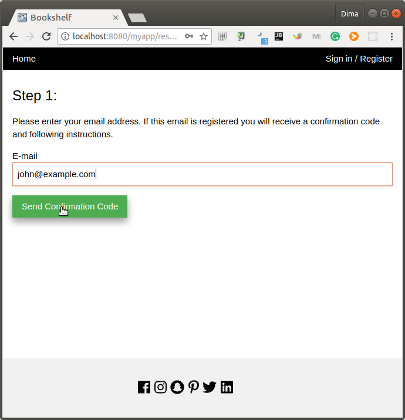

# Archetype for simple WEB project

Archetype to create simple WEB project using JSF, JPA, CDI, security etc.

This archetype helps you to create boilerplate project with all configuration and set of pages for user registration, login and resetting password.

For registration and password resetting this app will send emails with confirmation code.

# What you will have out of the box

## Registration screen

After entering data email will be sent to confirm email address:

## Login screen

## Resetting password

If users lost their password it will be possible to change it. Confirmation code will be sent by email.

# How to start

## From Intellij IDEA

### Step 1

1. Start creating new project `File -> New -> Project`

2. In the New Project dialog from the left sidebar select Maven.

3. Select checkbox `Create from archetype`

4. Press button `Add Archetype...`

5. Enter following data and click `OK`:
   
   Group Id:    `guru.bug.javacourses`
   
   Artifact Id: `webproject`
   
   Version:     `2.0.0`
   
   Repository:  *leave empty*
   

### Step 2

1. Find `guru.bug.javacourses:webproject` in the list and expand it. 

2. There is entry `webproject:2.0.0` - select it. 

3. Press `Next`

### Step 3

1. Fill the form and press `Next`:
   
   Group Id: your project's group id. This is also base package for the project. For example `lv.tsi.javacourses`

   Artifact Id: name of your project. Please don't use dashes, dots, spaces - only latin letters and numbers. For example `myCatalog`. 
   This will be used not only maven artifact id, but as datasource, database and context root.
   
   Version: `1.0-SNAPSHOT` by default, but any version number you like.
 

### Step 4
   
Next form is informational, you may skip it pressing `Next`

### Step 5

1. Ensure right directory is selected for you project to be created. 

2. And press `Finish`

### Step 6

1. Examine created project

2. Follow instructions in `README.md` to continue

### Step 7

12. Create Run Configuration for WildFly - app should work if everything is configured correctly. 

